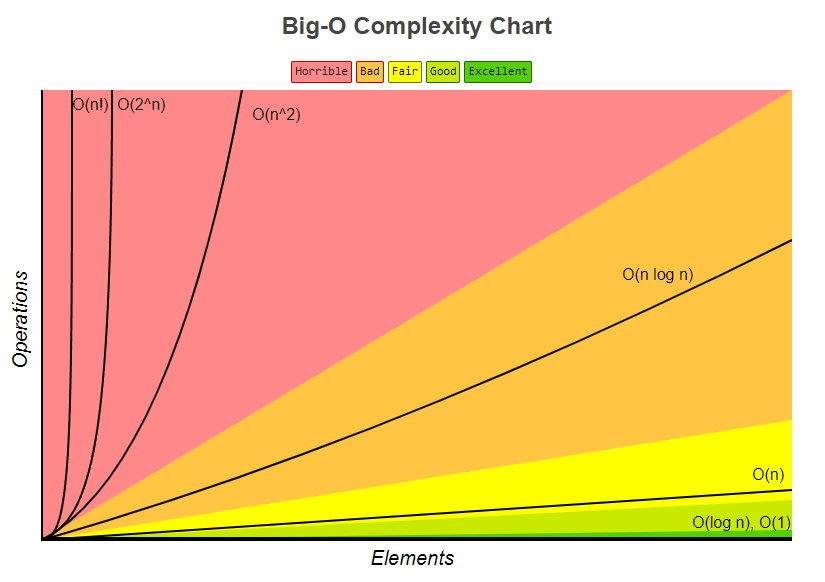

# Data Structures & Algorithms 

This repository contains sample implementations of common algorithms and data structures in python

*☝ Note that this project is meant to be used for learning and researching purposes
only, and it is **not** meant to be used for production.*

## Data Structures

* Linked List
  * [Singly Linked List](src/data_structures/linked_list)

## Algorithms

* [Sorting](src/algorithms/sorting/)
  * [Bubble sort](src/algorithms/sorting/bubble_sort)

## How to use this repository
Create virtual environment (recommended)
```bat
$ python -m venv .venv
```
Activate virtual environment
```bat
$ .venv/Scripts/activate
```
Install packages
```bat
$ pip install -e src/
```
Run all tests (with verbose output `-v`)
```bat
$ python -m unittest discover -v
```
Run specific test (you can also run the test file `$ python test_file.py`)
```bat
$ python -m unittest tests.test_algorithms_sorting_bubble_sort
```
Use pattern to match test files `-p`
```bat
$ python -m unittest discover -v -p *sort*
```
## Additional Information

### Big O Notation

*Big O notation* is a way to measure an algorithm efficiency. It measures the time it take to run your function as the input grows. Or in other words, how well does the function scale. On the chart below you may find most common orders of growth of algorithms specified in Big O notation. 



*Source:* [Big O Cheat Sheet](http://bigocheatsheet.com/).

Below is the list of some of the most used Big O notations and their performance comparisons against different sizes of the input data.

| Big O Notation | Type        | Computations for 10 elements | Computations for 100 elements | Computations for 1000 elements  |
| -------------- | ----------- | ---------------------------- | ----------------------------- | ------------------------------- |
| **O(1)**       | Constant    | 1                            | 1                             | 1                               |
| **O(log N)**   | Logarithmic | 3                            | 6                             | 9                               |
| **O(N)**       | Linear      | 10                           | 100                           | 1000                            |
| **O(N log N)** | n log(n)    | 30                           | 600                           | 9000                            |
| **O(N^2)**     | Quadratic   | 100                          | 10000                         | 1000000                         |
| **O(2^N)**     | Exponential | 1024                         | 1.26e+29                      | 1.07e+301                       |
| **O(N!)**      | Factorial   | 3628800                      | 9.3e+157                      | 4.02e+2567                      |

### Common Data Structure Operations Complexity (in the worst case)

| Data Structure     | Access    | Search    | Insertion | Deletion  | Space Complexity |
|--------------------|-----------|-----------|-----------|-----------|------------------|
| Array              | O(1)      | O(n)      | O(n)      | O(n)      | O(n)             |
| Stack              | O(n)      | O(n)      | O(1)      | O(1)      | O(n)             |
| Queue              | O(n)      | O(n)      | O(1)      | O(1)      | O(n)             |
| Singly-Linked List | O(n)      | O(n)      | O(1)      | O(1)      | O(n)             |
| Doubly-Linked List | O(n)      | O(n)      | O(1)      | O(1)      | O(n)             |
| Skip List          | O(n)      | O(n)      | O(n)      | O(n)      | O(n log(n))      |
| Hash Table         | N/A       | O(n)      | O(n)      | O(n)      | O(n)             |
| Binary Search Tree | O(n)      | O(n)      | O(n)      | O(n)      | O(n)             |
| Cartesian Tree     | N/A       | O(n)      | O(n)      | O(n)      | O(n)             |
| B-Tree             | O(log(n)) | O(log(n)) | O(log(n)) | O(log(n)) | O(n)             |
| Red-Black Tree     | O(log(n)) | O(log(n)) | O(log(n)) | O(log(n)) | O(n)             |
| Splay Tree         | N/A       | O(log(n)) | O(log(n)) | O(log(n)) | O(n)             |
| AVL Tree           | O(log(n)) | O(log(n)) | O(log(n)) | O(log(n)) | O(n)             |
| KD Tree            | O(n)      | O(n)      | O(n)      | O(n)      | O(n)             |                |


### Array Sorting Algorithms Complexity

| Algorithm      | Best        | Average        | Worst          | Space Complexity (Worst) |
|----------------|-------------|----------------|----------------|--------------------------|
| Quicksort      | Ω(n log(n)) | Θ(n log(n))    | O(n^2)         | O(log(n))                |
| Mergesort      | Ω(n log(n)) | Θ(n log(n))    | O(n log(n))    | O(n)                     |
| Timsort        | Ω(n)        | Θ(n log(n))    | O(n log(n))    | O(n)                     |
| Heapsort       | Ω(n log(n)) | Θ(n log(n))    | O(n log(n))    | O(1)                     |
| Bubble Sort    | Ω(n)        | Θ(n^2)         | O(n^2)         | O(1)                     |
| Insertion Sort | Ω(n)        | Θ(n^2)         | O(n^2)         | O(1)                     |
| Selection Sort | Ω(n^2)      | Θ(n^2)         | O(n^2)         | O(1)                     |
| Tree Sort      | Ω(n log(n)) | Θ(n log(n))    | O(n^2)         | O(n)                     |
| Shell Sort     | Ω(n log(n)) | Θ(n(log(n))^2) | O(n(log(n))^2) | O(1)                     |
| Bucket Sort    | Ω(n+k)      | Θ(n+k)         | O(n^2)         | O(n)                     |
| Radix Sort     | Ω(nk)       | Θ(nk)          | O(nk)          | O(n+k)                   |
| Counting Sort  | Ω(n+k)      | Θ(n+k)         | O(n+k)         | O(k)                     |
| Cubesort       | Ω(n)        | Θ(n log(n))    | O(n log(n))    | O(n)                     |