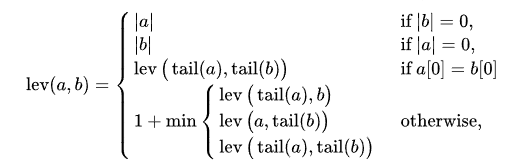

# Levenshtein Distance

The Levenshtein distance is a string metric for measuring the difference between two sequences. Informally, the Levenshtein distance between two words is the minimum number of single-character edits (insertions, deletions or substitutions) required to change one word into the other.

## Definition
The Levenshtein distance between two strings *a*, *b* (of length |a| and |b| respectively) is given by *lev(a, b)* where:

## Example

The Levenshtein distance between `kitten` and `sitting` is 3, since the following 3 edits change one into the other, and there is no way to do it with fewer than 3 edits:

1. kitten → sitten (substitution of "s" for "k"),
2. sitten → sittin (substitution of "i" for "e"),
3. sittin → sitting (insertion of "g" at the end).

*source:* [Wikipedia](https://en.wikipedia.org/wiki/Levenshtein_distance)

# Complexity

| Algorithm            | Best     | Average  | Worst    | Space |
|----------------------|----------|----------|----------|-------|
| Levenshtein distance | Ω(m * n) | Θ(m * n) | O(m * n) | O(m)  |